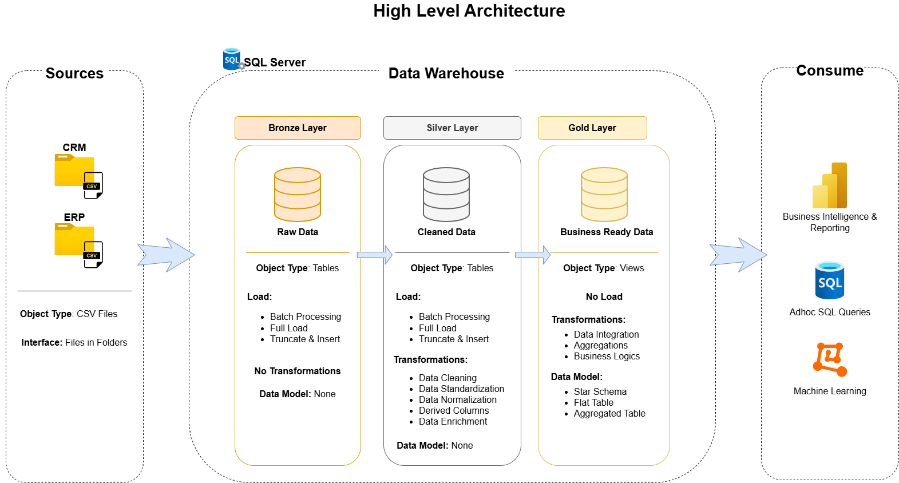

# Data Warehouse and Analytics Project

Welcome to the **Data Warehouse and Analytics Project** repository!
This project demonstrates a comprehensive data warehousing and analytics solution, from building a datawarehouse to generating actionable insights. Designed as a portfolio project which highlights industry best practices in data engineering and analytics.

---

## Project Requirements

### Building the Data Warehouse (Data Engineering)

#### Objective
Develop a modern data warehouse using Microsoft SQL Server to consolidate sales data, enabling analytical reporting and informed decision-making.

#### Specifications
- **Data Sources**: Import data from two source systems (CRM and ERP) provided as CSV files.
- **Data Quality**: Cleanse and resolve data quality issues prior to analysis.
- **Integration**: Combine both sources into a single, user-friendly data model designed for analytical queries.
- **Scope**: Focus on the latest dataset only. Historical data is not required.
- **Documentation**: Provide clear documentation of the data model to support both business stakeholders and analytics team.

---

### BI: Analytics & Reporting (Data Analytics)

#### Objective
Develop SQL-based analytics to deliver detailed insights into:
- **Customer Behavior**
- **Product Performance**
- **Sales Trends**

These insights empower stakeholders with key business metrics, enabling strategic decision-making.

---
## Data Architecture

The data architecture for this project follows the Medallion Architecture **Bronze**, **Silver**, and **Gold** layers:

1. **Bronze Layer**: Stores raw data as-is from the source systems. Data is ingested from CSV Files into Microsoft SQL Server Database.
2. **Silver Layer**: This layer includes data cleansing, standardization, and normalization processes to prepare data for analysis.
3. **Gold Layer**: Houses business-ready data modeled into a star schema required for reporting and analytics.

---
# **Naming Conventions**

## **Table of Contents**

1. [General Principles](#general-principles)
2. [Table Naming Conventions](#table-naming-conventions)
   - [Bronze Rules](#bronze-rules)
   - [Silver Rules](#silver-rules)
   - [Gold Rules](#gold-rules)
3. [Column Naming Conventions](#column-naming-conventions)
   - [Surrogate Keys](#surrogate-keys)
   - [Technical Columns](#technical-columns)
4. [Stored Procedure](#stored-procedure-naming-conventions)
---

## **General Principles**

- **Naming Conventions**: Use snake_case, with lowercase letters and underscores (`_`) to separate words.
- **Avoid Reserved Words**: Do not use SQL reserved words as object names.

## **Table Naming Conventions**

### **Bronze Rules**
- All names must start with the source system name, and table names must match their original names without renaming.
- **`<sourcesystem>_<entity>`**  
  - `<sourcesystem>`: Name of the source system (e.g., `crm`, `erp`).  
  - `<entity>`: Exact table name from the source system.  
  - Example: `crm_customer_info` → Customer information from the CRM system.

### **Silver Rules**
- All names must start with the source system name, and table names must match their original names without renaming.
- **`<sourcesystem>_<entity>`**  
  - `<sourcesystem>`: Name of the source system (e.g., `crm`, `erp`).  
  - `<entity>`: Exact table name from the source system.  
  - Example: `crm_customer_info` → Customer information from the CRM system.

### **Gold Rules**
- All names must use meaningful, business-aligned names for tables, starting with the category prefix.
- **`<category>_<entity>`**  
  - `<category>`: Describes the role of the table, such as `dim` (dimension) or `fact` (fact table).  
  - `<entity>`: Descriptive name of the table, aligned with the business domain (e.g., `customers`, `products`, `sales`).  
  - Examples:
    - `dim_customers` → Dimension table for customer data.  
    - `fact_sales` → Fact table containing sales transactions.  

#### **Glossary of Category Patterns**

| Pattern     | Meaning                           | Example(s)                              |
|-------------|-----------------------------------|-----------------------------------------|
| `dim_`      | Dimension table                  | `dim_customer`, `dim_product`           |
| `fact_`     | Fact table                       | `fact_sales`                            |
| `report_`   | Report table                     | `report_customers`, `report_sales_monthly`   |

## **Column Naming Conventions**

### **Surrogate Keys**  
- All primary keys in dimension tables must use the suffix `_key`.
- **`<table_name>_key`**  
  - `<table_name>`: Refers to the name of the table or entity the key belongs to.  
  - `_key`: A suffix indicating that this column is a surrogate key.  
  - Example: `customer_key` → Surrogate key in the `dim_customers` table.
  
### **Technical Columns**
- All technical columns must start with the prefix `dwh_`, followed by a descriptive name indicating the column's purpose.
- **`dwh_<column_name>`**  
  - `dwh`: Prefix exclusively for system-generated metadata.  
  - `<column_name>`: Descriptive name indicating the column's purpose.  
  - Example: `dwh_load_date` → System-generated column used to store the date when the record was loaded.
 
## **Stored Procedure**

- All stored procedures used for loading data must follow the naming pattern:
- **`load_<layer>`**.
  
  - `<layer>`: Represents the layer being loaded, such as `bronze`, `silver`, or `gold`.
  - Example: 
    - `load_bronze` → Stored procedure for loading data into the Bronze layer.
    - `load_silver` → Stored procedure for loading data into the Silver layer.

## About Me

Hi! I am **Xavier**, an aspiring data engineer. I have a background in Storage and Backup supporting over 400 Virtual Machines and Databases. 
