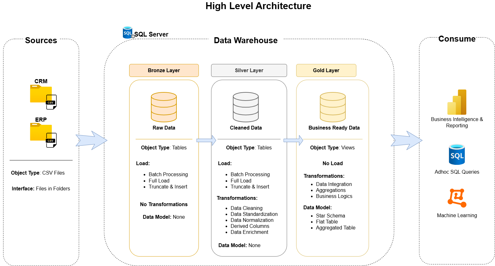
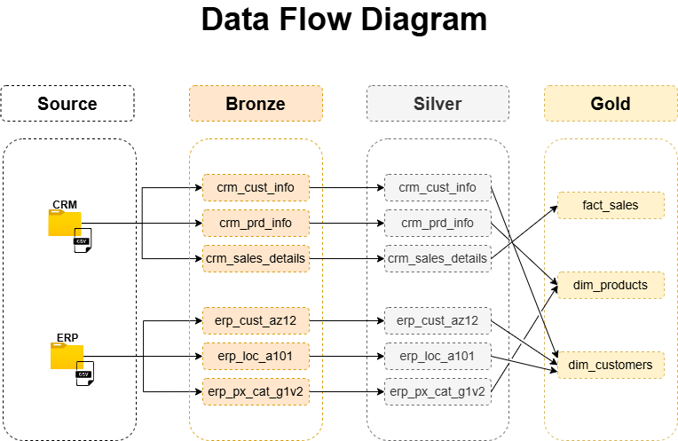
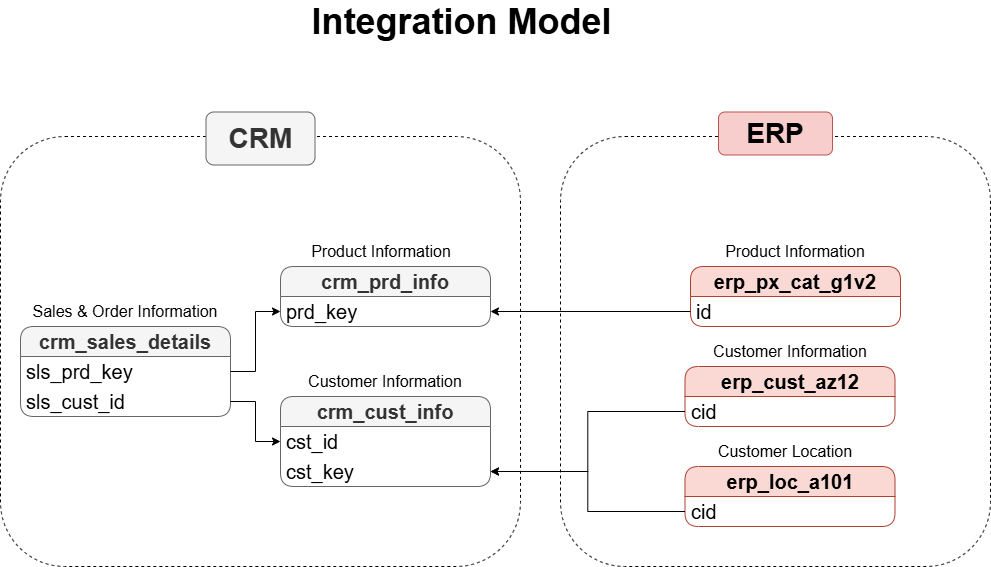

## **Table of Contents**
1. [About Me](#about-me)
2. [Project Overview](#data-warehouse-and-analytics-project)
3. [Project Requirements](#project-requirements)
4. [Data Architecture](#data-architecture)
5. [Data Flow Diagram](#data-flow-diagram)
6. [Integration Model](#integration-model)
7. [General Principles](#general-principles)
8. [Table Naming Conventions](#table-naming-conventions)
   - [Bronze Rules](#bronze-rules)
   - [Silver Rules](#silver-rules)
   - [Gold Rules](#gold-rules)
9. [Column Naming Conventions](#column-naming-conventions)
   - [Surrogate Keys](#surrogate-keys)
   - [Technical Columns](#technical-columns)
10. [Stored Procedure](#stored-procedure-naming-conventions)
11. [Tools](#tools)
12. [Project Structure](#project-structure)
13. [Data Sources](#data-sources)
14. [Data Catalog](#data-catalog)
15. [Future Enhancements](#future-enhancements)
16. [Project Roadmap](#project-roadmap)
17. [Credits and Acknowledgedments](#credits-and-acknowledgements)
---

## About Me

I am currently working as a Storage and Backup Administrator in Accenture and is transitioning into Data Engineering — my long term career aspiration. With a strong foundation as a backup administrator, handling backup infrastructure, ensuring data availability and reliability, I am now channeling that experience into building data pipelines and warehouse systems that transform raw data into business value.

This project represents my hands-on journey into data engineering — built from scratch to demonstrate end-to-end data warehouse development using industry standard tools, architectures, and best practices.

Open to Junior Data Engineering opportunities. Let's connect!
LinkedIn: https://www.linkedin.com/in/rxavierremo

# Data Warehouse and Analytics Project

Welcome to the **Data Warehouse and Analytics Project** repository!
This project demonstrates a comprehensive data warehousing and analytics solution, from building a datawarehouse to generating actionable insights. Designed as a portfolio project which highlights industry best practices in data engineering and analytics.

---

## Project Requirements

### Building the Data Warehouse (Data Engineering)

#### Objective
Develop a modern data warehouse using Microsoft SQL Server to consolidate sales data, enabling analytical reporting and informed decision-making.

#### Specifications
- **Data Sources**: Import data from two source systems (CRM and ERP) provided as CSV files.
- **Data Quality**: Cleanse and resolve data quality issues prior to analysis.
- **Integration**: Combine both sources into a single, user-friendly data model designed for analytical queries.
- **Scope**: Focus on the latest dataset only. Historical data is not required.
- **Documentation**: Provide clear documentation of the data model to support both business stakeholders and analytics team.

---

### BI: Analytics & Reporting (Data Analytics)

#### Objective
Develop SQL-based analytics to deliver detailed insights into:
- **Customer Behavior**
- **Product Performance**
- **Sales Trends**

These insights empower stakeholders with key business metrics, enabling strategic decision-making.

---
## Data Architecture

The Data Architecture for this project follows the Medallion Architecture **Bronze**, **Silver**, and **Gold** layers:



1. **Bronze Layer**: Stores raw data as-is from the source systems. Data is ingested from CSV Files into Microsoft SQL Server Database.
2. **Silver Layer**: This layer includes data cleansing, standardization, and normalization processes to prepare data for analysis.
3. **Gold Layer**: Houses business-ready data modeled into a star schema required for reporting and analytics.

## Data Flow Diagram

The Data Flow Diagram illustrates how data moves from source systems through the Bronze, Silver, and Gold layers of the data warehouse.



## Integration Model

The Integration Model shows the relationships between the two source systems.



---

## **General Principles**

- **Naming Conventions**: Use snake_case, with lowercase letters and underscores (`_`) to separate words.
- **Avoid Reserved Words**: Do not use SQL reserved words as object names.

## **Table Naming Conventions**

### **Bronze Rules**
- All names must start with the source system name, and table names must match their original names without renaming.
- **`<sourcesystem>_<entity>`**  
  - `<sourcesystem>`: Name of the source system (e.g., `crm`, `erp`).  
  - `<entity>`: Exact table name from the source system.  
  - Example: `crm_customer_info` → Customer information from the CRM system.

### **Silver Rules**
- All names must start with the source system name, and table names must match their original names without renaming.
- **`<sourcesystem>_<entity>`**  
  - `<sourcesystem>`: Name of the source system (e.g., `crm`, `erp`).  
  - `<entity>`: Exact table name from the source system.  
  - Example: `crm_customer_info` → Customer information from the CRM system.

### **Gold Rules**
- All names must use meaningful, business-aligned names for tables, starting with the category prefix.
- **`<category>_<entity>`**  
  - `<category>`: Describes the role of the table, such as `dim` (dimension) or `fact` (fact table).  
  - `<entity>`: Descriptive name of the table, aligned with the business domain (e.g., `customers`, `products`, `sales`).  
  - Examples:
    - `dim_customers` → Dimension table for customer data.  
    - `fact_sales` → Fact table containing sales transactions.  

#### **Glossary of Category Patterns**

| Pattern     | Meaning                           | Example(s)                              |
|-------------|-----------------------------------|-----------------------------------------|
| `dim_`      | Dimension table                  | `dim_customer`, `dim_product`           |
| `fact_`     | Fact table                       | `fact_sales`                            |
| `report_`   | Report table                     | `report_customers`, `report_sales_monthly`   |

## **Column Naming Conventions**

### **Surrogate Keys**  
- All primary keys in dimension tables must use the suffix `_key`.
- **`<table_name>_key`**  
  - `<table_name>`: Refers to the name of the table or entity the key belongs to.  
  - `_key`: A suffix indicating that this column is a surrogate key.  
  - Example: `customer_key` → Surrogate key in the `dim_customers` table.
  
### **Technical Columns**
- All technical columns must start with the prefix `dwh_`, followed by a descriptive name indicating the column's purpose.
- **`dwh_<column_name>`**  
  - `dwh`: Prefix exclusively for system-generated metadata.  
  - `<column_name>`: Descriptive name indicating the column's purpose.  
  - Example: `dwh_load_date` → System-generated column used to store the date when the record was loaded.
 
## **Stored Procedure**

- All stored procedures used for loading data must follow the naming pattern:
- **`load_<layer>`**.
  
  - `<layer>`: Represents the layer being loaded, such as `bronze`, `silver`, or `gold`.
  - Example: 
    - `load_bronze` → Stored procedure for loading data into the Bronze layer.
    - `load_silver` → Stored procedure for loading data into the Silver layer.

## Tools:

- **[SQL Server Express](https://www.microsoft.com/en-us/sql-server/sql-server-downloads):**
- **[SQL Server Management Studio (SSMS)](https://learn.microsoft.com/en-us/sql/ssms/download-sql-server-management-studio-ssms?view=sql-server-ver16):** 
- **[DrawIO](https://www.drawio.com/):**

---
## Project Structure
```
sql-data-warehouse-project/
│
├── datasets/                    # Source CSV files
│   ├── source_erp/
│   │   ├── CUST_AZ12.csv
│   │   ├── LOC_A101.csv
│   │   └── PX_CAT_G1V2.csv
│   └── source_crm/
│       ├── cust_info.csv
│       ├── prd_info.csv
│       └── sales_details.csv
│
├── docs/                        # Documentation and diagrams
│   ├── diagrams/
│   │   ├── integration_model.png
│   │   ├── data_architecture.png
│   │   ├── dwh_design.png
│   │   └── data_flow_diagram.png
│   └── data_catalog.md
│
├── scripts/                     # All SQL scripts
│   ├── bronze/
│   │   ├── bronze.load_bronze.sql
│   │   └── bronze.create_tables.sql
│   ├── silver/
│   │   ├── silver.silver_load.sql
│   │   └── --.sql
│   └── gold/
│       ├── --.sql
│       └── --.sql
│
│
├── tests/                       # Data quality test scripts
│   └── --.sql
│
└── README.md
```
## Data Sources

This project uses data from two source systems:

**ERP System**
- CUST_AZ12.csv — Customer demographics including customer ID, 
  birth date, and gender
- LOC_A101.csv — Customer location data including customer ID 
  and country
- PX_CAT_G1V2.csv — Product category information

**CRM System**
- cust_info.csv
- prd_info.csv
- sales_details.csv

All source files are in CSV format with comma delimiters and are stored in the datasets/ folder.

---
## Data Catalog

### Bronze Layer

#### bronze.crm_cust_info
| Column | Data Type | Description | Example |
|--------|-----------|-------------|---------|
| cst_id | INT | Unique customer identifier from CRM system | 11000 |
| cst_key | NVARCHAR(50) | Customer key | NASAW00011000 |
| cst_firstname | NVARCHAR(50) | Customer first name | Mary, Kent |
| cst_lastname | NVARCHAR(50) | Customer last name | John, Johnson |
| cst_marital_status | NVARCHAR(20) | Customer marital Status (raw, unstandardized) | S, M |
| cst_gndr | NVARCHAR(10) | Customer gender (raw, unstandardized) | Male, M, Female, F |
| cst_create_date | DATE | Customer creation date | 20200117 |

#### bronze.crm_prd_info
| Column | Data Type | Description | Example |
|--------|-----------|-------------|---------|
| prd_id | INT | Unique product identifier from CRM system | 11000 |
| prd_key | NVARCHAR(50) | Product key | NASAW00011000 |
| prd_nm | NVARCHAR(50) | Product name | Mountain Bike |
| prd_cost | INT | Product cost | 1 |
| prd_line | NVARCHAR(50) | Product line | S, M |
| prd_start_dt | DATE | Product start date | 20200101 |
| prd_end_dt | DATE | Product end date | 20200101 |

#### bronze.crm_sales_details
| Column | Data Type | Description | Example |
|--------|-----------|-------------|---------|
| sls_ord_num | NVARCHAR(50) | Unique sales order number from CRM system | 11000 |
| sls_prd_key | NVARCHAR(50) | Sales product key | NASAW00011000 |
| sls_cust_id | INT | Sales customer id | Mountain Bike |
| sls_order_id | INT | Sales order id | 1 |
| sls_ship_dt | INT | Sales shipping date  | S, M |
| sls_due_dt | INT | Sales due date | 20200101 |
| sls_sales | INT | Sales information | 20200101 |
| sls_quantity | INT | Sales quantity | 20200101 |
| sls_price | INT | Sales price | 20200101 |

#### bronze.erp_cust_az12
| Column | Data Type | Description | Example |
|--------|-----------|-------------|---------|
| cid | NVARCHAR(50) | Unique customer identifier from ERP system | NASAW00011000 |
| bdate | DATE | Customer date of birth | 1971-10-06 |
| gen | NVARCHAR(10) | Customer gender (raw, unstandardized) | Male, M, Female, F |

#### bronze.erp_loc_a101
| Column | Data Type | Description | Example |
|--------|-----------|-------------|---------|
| cid | NVARCHAR(50) | Unique customer identifier from ERP system | AW-00011000 |
| cntry | NVARCHAR(50) | Customer country (raw, unstandardized) | US, Australia |

#### bronze.erp_px_cat_g1v2
| Column | Data Type | Description | Example |
|--------|-----------|-------------|---------|
| id | INT | Unique product id from ERP system | AW-00011000 |
| cat | NVARCHAR(50) | Product category | US, Australia |
| subcat | NVARCHAR(50) | Product sub-category | US, Australia |
| maintenance | NVARCHAR(10) | Customer country (raw, unstandardized) | US, Australia |

### Silver Layer

#### silver.crm_cust_info
| Column | Data Type | Description | Example |
|--------|-----------|-------------|---------|
| cst_id | INT | Unique customer identifier from CRM system | 11000 |
| cst_key | NVARCHAR(50) | Customer key | NASAW00011000 |
| cst_firstname | NVARCHAR(50) | Customer first name | Mary, Kent |
| cst_lastname | NVARCHAR(50) | Customer last name | John, Johnson |
| cst_marital_status | NVARCHAR(20) | Customer marital Status (raw, unstandardized) | S, M |
| cst_gndr | NVARCHAR(10) | Customer gender (raw, unstandardized) | Male, M, Female, F |
| cst_create_date | DATE | Customer creation date | 20200117 |

#### silver.crm_prd_info
| Column | Data Type | Description | Example |
|--------|-----------|-------------|---------|
| prd_id | INT | Unique product identifier from CRM system | 11000 |
| prd_key | NVARCHAR(50) | Product key | NASAW00011000 |
| prd_nm | NVARCHAR(50) | Product name | Mountain Bike |
| prd_cost | INT | Product cost | 1 |
| prd_line | NVARCHAR(50) | Product line | S, M |
| prd_start_dt | DATE | Product start date | 20200101 |
| prd_end_dt | DATE | Product end date | 20200101 |

#### silver.crm_sales_details
| Column | Data Type | Description | Example |
|--------|-----------|-------------|---------|
| sls_ord_num | NVARCHAR(50) | Unique sales order number from CRM system | 11000 |
| sls_prd_key | NVARCHAR(50) | Sales product key | NASAW00011000 |
| sls_cust_id | INT | Sales customer id | 11000 |
| sls_order_id | INT | Sales order id | 1 |
| sls_ship_dt | INT | Sales shipping date  | 20200101 |
| sls_due_dt | INT | Sales due date | 20200101 |
| sls_sales | INT | Sales information | 20200101 |
| sls_quantity | INT | Sales quantity | 2 |
| sls_price | INT | Sales price | 1 |

#### silver.erp_cust_az12
| Column | Data Type | Description | Example |
|--------|-----------|-------------|---------|
| cid | NVARCHAR(50) | Unique customer identifier from ERP system | NASAW00011000 |
| bdate | DATE | Customer date of birth | 1971-10-06 |
| gen | NVARCHAR(10) | Customer gender (raw, unstandardized) | Male, M, Female, F |

#### silver.erp_loc_a101
| Column | Data Type | Description | Example |
|--------|-----------|-------------|---------|
| cid | NVARCHAR(50) | Unique customer identifier from ERP system | AW-00011000 |
| cntry | NVARCHAR(50) | Customer country (raw, unstandardized) | US, Australia |

#### silver.erp_px_cat_g1v2
| Column | Data Type | Description | Example |
|--------|-----------|-------------|---------|
| id | INT | Unique product id from ERP system | AW-00011000 |
| cat | NVARCHAR(50) | Product category | US, Australia |
| subcat | NVARCHAR(50) | Product sub-category | US, Australia |
| maintenance | NVARCHAR(10) | Customer country (raw, unstandardized) | US, Australia |

---
## Future Enhancements

### Pipeline Automation
- [ ] Add pipeline execution logging table
- [ ] Build Python pipeline scripts for all three layers

### Data Modeling
- [ ] Add data quality automated test framework

### Modern Tooling
- [ ] Implement Apache Airflow for pipeline scheduling and orchestration

### Visualization
- [ ] Build Power BI dashboard on top of Gold layer
---
## Project Roadmap

| Layer | Task | Status |
|-------|------|--------|
| Bronze | Create Database and Schemas | ✅ Complete |
| Bronze | Create Tables | ✅ Complete |
| Bronze | Bulk insert all source files | ✅ Complete |
| Silver | Create Tables | ✅ Complete |
| Silver | Data Standardization | ✅ Complete |
| Silver | Deduplication | 🔄 In Progress |
| Gold | Dimensional Modeling | ✅ Complete |
| Gold | Create Fact Tables | ✅ Complete |
| Gold | Create Dimension Tables | ✅ Complete |
| Docs | Architecture Diagram | ✅ Complete |
| Docs | Integration Diagram | ✅ Complete |
| Docs | Data Catalog | ✅ Complete |
| Docs | Dashboarding/Analytics | ⏳ Planned |

---
## Credits and Acknowledgements

This project was built following the teachings and guidance of **Data With Baraa** as a hands-on learning exercise in Data Engineering.

Original project concept and dataset: [[Link to original repo](https://github.com/DataWithBaraa/sql-data-warehouse-project)]

---
